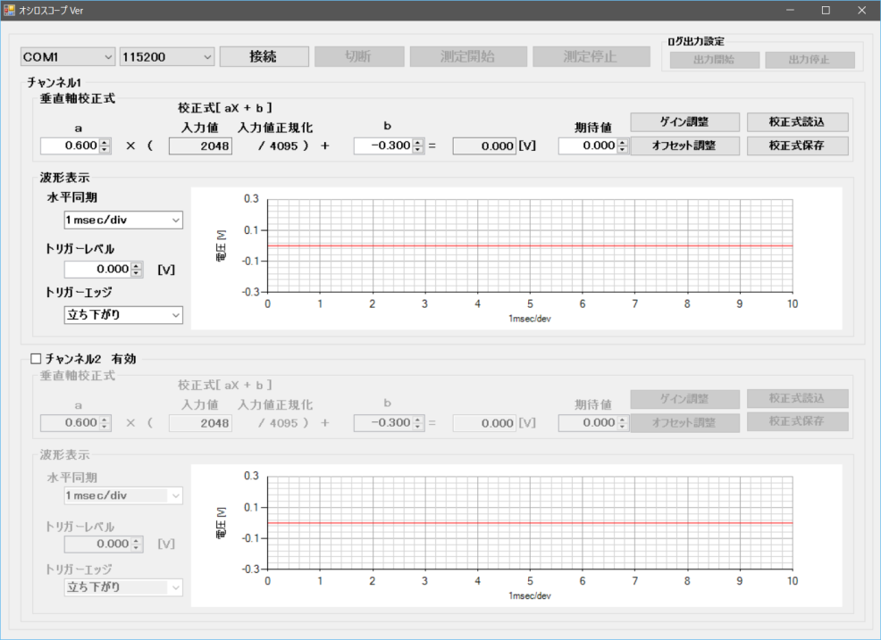
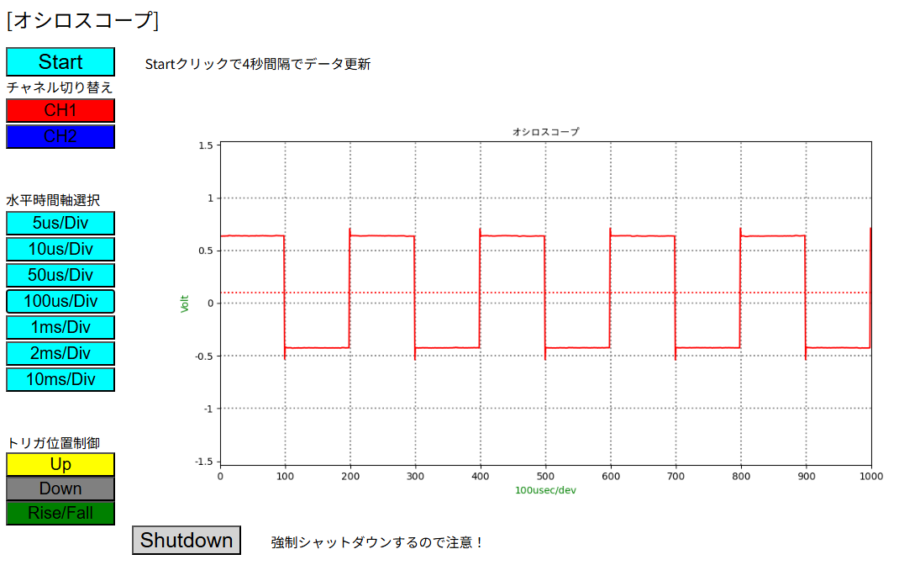

# ADCQ1706BP トランジスタ技術　2017年6月号連動企画　Raspberry Pi対応USBオシロスコープ

##  パイプライン型A/Dコンバータによる10Mspsの高速A/D変換！ラズベリー・パイで気軽に扱えるUSBオシロスコープ！

  

## 商品情報
ネットワーク機能などラズベリー・パイ（以下ラズパイ）が得意なことはラズパイに任せ、リアルタイム性能に優れたPICマイコンと組み合わせることでラズベリー・パイを高機能部品として活用します。
ラズパイのネットワーク機能を活かしパソコン・スマートフォンなどのブラウザから波形表示を観測可能な一方、PICマイコンのリアルタイム性能を活かし高速なアナログデータの取込、最高10Msps、高分解能12ビットでの高速A/D変換を実現しています。

パイプライン型A/Dコンバータで10Mspsの高速A/D変換。
通常の逐次変換方式のコンパレータ部をパイプライン構成にすることで1クロックごとにA/D変換結果を出力、最高10Msps高分解能12ビットでの高速A/D変換が可能です。

ラズパイが計測結果を素早くロギング、ネットワーク経由でパソコン・スマートフォンなどのブラウザ上で波形観測が可能！
収集したデータをラズパイが素早くロギング。
ラズパイのネットワーク性能を活かしグラフやブラウザでの波形観測の他、ログを出力することも可能です。

USBで接続！シリアル変換アダプタを同梱
標準でシリアル変換アダプタを同梱、ラズベリー・パイやパソコンなどUSB経由で直接接続可能です。 

## 製品詳細は[こちら](https://bit-trade-one.co.jp/product/module/adcq1706bp/)!

　
## 製品仕様
【対応機種】Raspberry Pi Model B+／Raspberry Pi 2 Model B／Raspberry Pi 3 Model B／Raspberry Pi 4 Model B／  
Windows11, Windows10, Windows8.1, Windows8, Windows7, Vista™搭載のDOS/Vパソコン
【入力端子】周波数測定用BNCコネクタ：2  
【電源】Raspberry Piより給電　5V  
【本体重量】　約52g  
【サイズ】W96×D59×H17mm(突起物除く)  
【付属品】シリアル変換アダプタ　1個　シリアル変換ケーブル　1組　 部品表1部　保証書1部（Raspberry Pi本体は付属しません）  
【組立済み保証期間】お買い上げから1年間  
【使用温度】0 〜 40℃（結露なきこと） 　
【生産国】Made in Japan  

## 測定性能仕様
【サンプリング周期】　最高4MHz  
【入力】 2チャネル　DCから数100kHz、分解能12ビット、入力電圧；10mV〜300mV
【水平同期】5μs、10μs、50μs、100μs、1ms、2ms、10ms（Div当たりの時間を各選択可能）  
【表示】　1チャネル切替表示　　波形表示部：2000×4096ピクセル  
【トリガ　】　立ち上がり、立下り選択、レベル設定  

## 参照リンク

### [後閑哲也先生監修！オシロスコープWeb詳細解説](https://bit-trade-one.co.jp/blog/oscillo-1/)  
2020.01.12記事投稿-IoTを始めよう！, 記事投稿-製作記事ADCQ1706B , 後閑哲也先生監修Web解説  
＊ 雑誌記事の一部に誤記があります。詳細はFAQを参照してください。  

### [Windows用アプリケーション](https://bit-trade-one.co.jp/wp/wp-content/uploads/2017/08/Oscilloscope.zip)  
＊ ダウンロード後、ZIPファイルを解凍してご使用ください。

### [雑誌掲載ファイル(Raspberry Piアプリケーションを含む）)](https://toragi.cqpub.co.jp/Portals/0/download/2017/TR1706P2.zip)
＊ Raspberry Piの種類、およびOSバージョンによっては修正が必要となる場合があります。

### [Raspberry Pi 4 サンプルアプリ](https://github.com/bit-trade-one/ADCQ1706BP_OscilloScope/tree/master/RapberryPi4/Oscilloscope)

## ―――本製品取扱についてのご注意―――
・本製品は、ホビー向け商品です。  
・記載の部品性能は部品単体での性能であり、製品寿命を保証するものではありません。  
・ご利用のPC、AndroidおよびOS環境によってはすべての機能をご利用いただけない場合があります。  
・アプリケーションソフトウェア導入のため別途インターネット環境が必要です。  
・一部のアプリケーションによっては本製品の機能をご利用できない場合があります。  
・本キットの製作/使用に関し当社の責に帰すべき事由に基づき、お客様に損害が生じた場合、直接被害に限り、販売代金を上限として損害を賠償し、いかなる場合においても販売代金以上の損害を賠償しないものとします。  
・改良のため、予告なく仕様変更をすることがあります。予めご了承下さい。  
そのほか記載されているロゴ、システム名、製品名は各社及び商標権者の登録商標あるいは商標です。  

＊Raspberry Pi本体及びケース、ケーブル類は付属致しません。  
Raspberry Piは英国Raspberry Pi財団の登録商標です。Raspberry Pi is a trademark of the Raspberry Pi Foundation.　そのほか記載されているロゴ、システム名、製品名は各社及び商標権者の登録商標あるいは商標です。  

